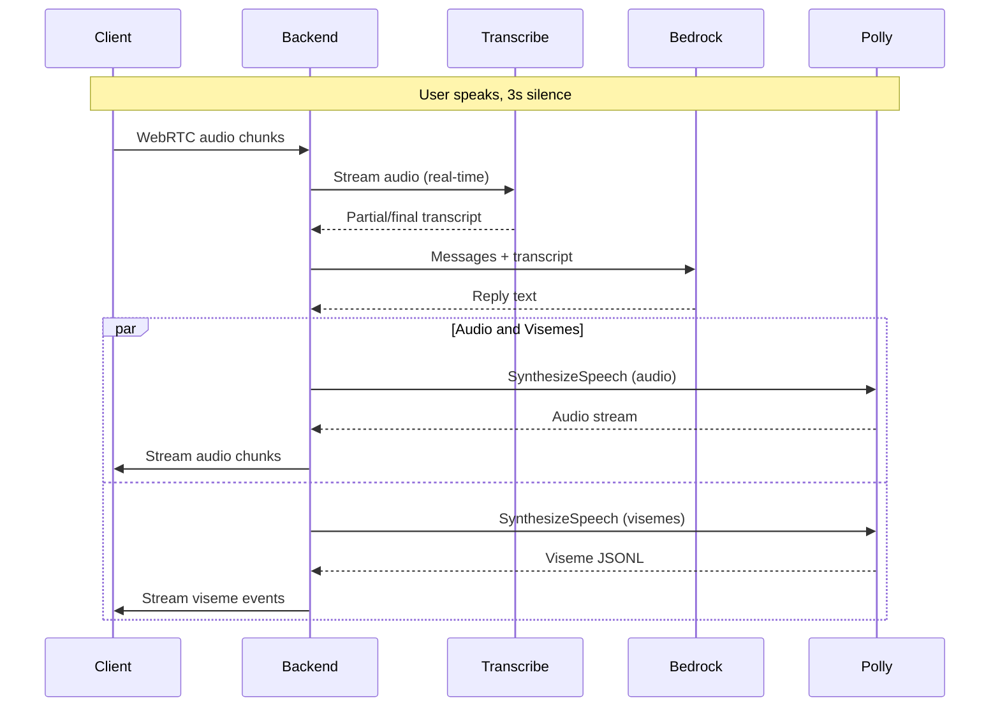

# AWS Resources Refactor Plan

## Scope

- **In scope:** Amazon Transcribe (STT), Amazon Bedrock (LLM), Amazon Polly Neural (TTS + visemes), Terraform for AWS resources, real-time streaming of audio both ways
- **Out of scope:** DynamoDB, Cognito, Lambda, S3, API Gateway (per "Not Yet Implemented")

---

## Architecture Decisions


| Component    | Choice                                          | Rationale                                                                                         |
| ------------ | ----------------------------------------------- | ------------------------------------------------------------------------------------------------- |
| TTS          | Polly **Neural** engine                         | Generative engine does not support viseme speech marks; neural provides real visemes for lip-sync |
| Visemes      | Stream from Polly `SpeechMarkTypes: ['viseme']` | Replace random/synthetic visemes with time-aligned Polly output                                   |
| STT          | Transcribe Streaming (WebSocket or HTTP/2)      | Real-time transcription as audio arrives                                                          |
| TTS delivery | Stream chunks to client as Polly returns them   | Current behavior buffers full response; target is progressive streaming                           |


---

## 1. Terraform

Create Terraform configuration to provision AWS resources used by the backend.

**Location:** `terraform/` (new directory at repo root)

**Resources to create:**

- **Provider:** AWS provider; default region `us-east-1` (configurable; project already uses us-east-1)
- **IAM Policy:** Policy document allowing:
  - `transcribe:StartStreamTranscription` (streaming)
  - `bedrock:InvokeModel`, `bedrock:InvokeModelWithResponseStream` (e.g., `us.anthropic.claude-3-haiku-20240307-v1:0`)
  - `polly:SynthesizeSpeech`
- **IAM User or Role:** For backend to assume (e.g., IAM user with access keys for local dev, or role for EC2/ECS)
- **Outputs:** `aws_region`, `policy_arn`, credentials instructions

**Example structure:**

```
terraform/
  main.tf         # provider (default region us-east-1), backend config
  iam.tf          # IAM policy + user/role
  variables.tf    # region default = us-east-1
  outputs.tf
```

**Bedrock model access:** Ensure the Bedrock model is enabled in the AWS account (model access is account-level, not Terraform-managed). Document that the user must enable desired models in Bedrock console.

---

## 2. Amazon Transcribe (STT)

**File:** [backend/stt.js](backend/stt.js)

**Current:** Buffers PCM in WAV, sends to OpenAI Whisper batch API after 3s silence.

**Target:** Use [Amazon Transcribe Streaming](https://docs.aws.amazon.com/transcribe/latest/dg/streaming.html) (WebSocket or HTTP/2). Stream PCM chunks to Transcribe as they arrive from WebRTC; receive partial/final transcripts.

**Flow (Option A — chosen):**

1. Use Transcribe **streaming** during VAD collection—pipe audio to Transcribe in real-time as VAD feeds chunks.
2. VAD still triggers on 3s silence. When triggered, Transcribe has already processed the stream; read final transcript.

**Transcribe streaming API:** `StartStreamTranscription` (HTTP/2) or WebSocket. Node.js: `@aws-sdk/client-transcribe-streaming` with `StartStreamTranscriptionCommand`. Input: PCM 16-bit LE, 16 kHz or 48 kHz (match our sample rate).

**IAM:** `transcribe:StartStreamTranscription`

---

## 3. Amazon Bedrock (LLM)

**File:** [backend/agent.js](backend/agent.js)

**Current:** `openai.chat.completions.create()` with `gpt-4o-mini`.

**Target:** Use Bedrock Converse API or `InvokeModel` with a Claude model (e.g., Claude 3 Haiku via `us.anthropic.claude-3-haiku-20240307-v1:0`). Convert OpenAI message format to Bedrock format.

**SDK:** `@aws-sdk/client-bedrock-runtime` — `ConverseCommand` or `InvokeModelCommand`.

**Message conversion:** OpenAI `[{role, content}]` → Bedrock `messages` array. System prompt → `system` block in Converse.

**IAM:** `bedrock:InvokeModel` (and `InvokeModelWithResponseStream` if streaming replies later).

---

## 4. Amazon Polly (TTS + Visemes)

**File:** [backend/agent.js](backend/agent.js)

**Current:** OpenAI TTS returns full MP3; backend sends entire buffer. Visemes are random/synthetic.

**Polly API limitation:** You **cannot** get audio and visemes in the same `SynthesizeSpeech` request. When you request speech marks (`OutputFormat: 'json'`, `SpeechMarkTypes`), Polly returns only JSON metadata—no audio. When you request audio (`OutputFormat: 'mp3'`), you get only the audio stream. Two separate requests are required.

**Target:**

1. **Audio:** `SynthesizeSpeech` with `Engine: 'neural'`, `VoiceId` (e.g., `Joanna`, `Matthew`), `OutputFormat: 'mp3'`. Read `AudioStream` in chunks (e.g., 2–4 KB) and send each chunk over the DataChannel immediately.
2. **Visemes:** Separate `SynthesizeSpeech` call with `OutputFormat: 'json'`, `SpeechMarkTypes: ['viseme']`, same text. Returns newline-delimited JSON; parse and send each viseme event over the DataChannel with `{ type: 'viseme', time, value }`. Polly viseme format uses `time` (ms) and `value` (viseme code like `p`, `t`, `S`, etc.—compatible with existing frontend map).

**Coordination:** Run audio and viseme requests in parallel (same text). Stream audio chunks as received; stream viseme events as parsed. Both use timestamps so the frontend can sync.

**IAM:** `polly:SynthesizeSpeech`

**Polly viseme mapping:** Frontend Avatar already uses viseme codes (`p`, `t`, `S`, `i`, `u`, `a`, `@`, `e`, `E`, `o`). [Polly viseme list](https://docs.aws.amazon.com/polly/latest/dg/viseme.html) is compatible.

---

## 5. Real-Time Streaming

### Backend

**Current:** `streamTTS` awaits full OpenAI response, then sends one large buffer.

**Target:**

- **Polly audio:** Use `response.body` (stream) and pipe/read in chunks. For each chunk: `sendAudioChunk(buf)`.
- **Polly visemes:** Parse JSONL stream and call `sendViseme(time, value)` for each event as it’s parsed.
- Order: start both requests; send data as it arrives. Audio and visemes are interleaved over the DataChannel (same as today’s protocol).

### Frontend

**Current:** [frontend/lib/useStreamingPlayback.ts](frontend/lib/useStreamingPlayback.ts) buffers chunks, decodes when it has enough, plays. [frontend/app/interview/page.tsx](frontend/app/interview/page.tsx) passes `streamedSpeechMarks` to Avatar.

**Target:** Minimal changes. Protocol stays the same: binary audio chunks + `{ type: 'viseme', time, value }` JSON. Ensure:

- Viseme `value` from Polly maps to Avatar’s expected codes (Polly uses similar set).
- Playback logic already handles progressive chunks; verify it works when chunks arrive over time instead of all at once.

---

## 6. Data Flow




---

## 7. Files to Change


| File                   | Changes                                                                                                                 |
| ---------------------- | ----------------------------------------------------------------------------------------------------------------------- |
| `terraform/` (new)     | IAM policy, provider, variables, outputs                                                                                |
| `backend/stt.js`       | Replace Whisper with Transcribe streaming                                                                               |
| `backend/agent.js`     | Replace OpenAI with Bedrock + Polly; stream audio and visemes                                                           |
| `backend/package.json` | Remove `openai`; add `@aws-sdk/client-transcribe-streaming`, `@aws-sdk/client-bedrock-runtime`, `@aws-sdk/client-polly` |
| `backend/preload.cjs`  | Load `AWS_REGION`, `AWS_ACCESS_KEY_ID`, `AWS_SECRET_ACCESS_KEY` (or use default credential chain)                       |
| `backend/README.md`    | Document AWS env vars, Terraform apply steps                                                                            |
| `frontend/...`         | Map Polly viseme codes to Avatar if needed; verify progressive playback                                                 |


---

## 8. Environment Variables


| Variable                | Purpose                                                  |
| ----------------------- | -------------------------------------------------------- |
| `AWS_REGION`            | Region (default `us-east-1`; set in Terraform variables) |
| `AWS_ACCESS_KEY_ID`     | For local dev (or use IAM role when deployed)            |
| `AWS_SECRET_ACCESS_KEY` | For local dev                                            |


---

## 9. Terraform Apply

1. `cd terraform && terraform init && terraform plan`
2. Create IAM user and attach policy (or use existing role).
3. Export credentials or configure AWS CLI profile.
4. Run backend with `AWS_REGION` set.

